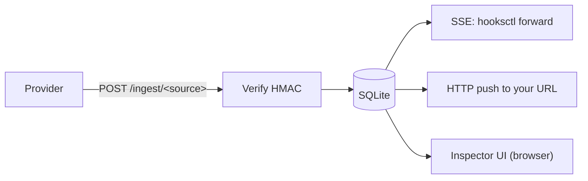

# hooks

A self-hosted webhook relay. `hooks` receives HMAC-signed inbound webhooks from providers like Render, Stripe, or your own services, persists them to SQLite, and re-delivers them to your developer environments — either pulled over Server-Sent Events with `hooksctl forward`, or pushed to a registered URL. Anything missed while a consumer was disconnected is replayed on reconnect.

The point: never lose a webhook because a laptop was asleep, a deploy was rolling, or a consumer service was down. One small Go binary, one SQLite file, no external dependencies.

## Status

- One process, SQLite-backed. Running two `hooks` processes against the same database is unsafe.
- One built-in provider today: **Render** (Standard Webhooks). Adding more is a short patch — see [Contributing](#3-contributing).
- Apache 2.0 licensed.

## How it fits together



The relay binds plain HTTP and is meant to sit behind a TLS-terminating proxy (Caddy, nginx, Cloudflare, Render, fly.io — anything). Providers refuse non-HTTPS endpoints, so this is enforced by the outside world either way.

---

## Try it locally first

To kick the tires without deploying anything:

```sh
make build                              # ./bin/hooks and ./bin/hooksctl
./bin/hooks init --server-url http://localhost:8080
export RENDER_WEBHOOK_SECRET=devsecret  # any non-empty value; you won't be receiving real Render deliveries
./bin/hooks                             # leave running; this is the relay
```

`init` prints a one-time signup URL and a one-time admin token. Open the signup URL in a browser and claim the first admin account (password ≥ 12 characters and not containing your email). Ignore the admin token for the local demo — it's a separate break-glass credential, explained in [Option B below](#option-b--run-the-container-yourself). Then in another terminal:

```sh
./bin/hooksctl login --server http://localhost:8080 --scopes render
./bin/hooksctl forward render --to http://localhost:3000/webhooks/render
./bin/hooksctl tail render              # watch events arrive in your terminal
```

You can also browse the inspector at <http://localhost:8080/> to see captured events.

To get real provider webhooks landing on your laptop, expose `:8080` to the public internet with [ngrok](https://ngrok.com), [Cloudflare Tunnel](https://www.cloudflare.com/products/tunnel/), or similar, and point the provider's webhook at `https://<tunnel>/ingest/render`.

After running `init` once, `make dev` is a faster loop on subsequent runs — it starts the server with debug logging and opens the inspector at <http://localhost:8080/>.

---

## 1. Deploy the server

The supported deployment path is the included `Dockerfile`. Both binaries (`hooks` and `hooksctl`) ship in the image, so token rotation, push-subscription management, and pruning all work via `docker exec`.

### Option A — Render Blueprint (one-click)

The repo includes a `render.yaml` Blueprint. In the Render dashboard:

1. **New → Blueprint**, point it at this repo (fork first if you want autoDeploy on your own pushes).
2. In the service's **Environment** tab, set:
    - `HOOKS_PUBLIC_URL` *(optional, recommended)* — your service's external URL, e.g. `https://hooks-abc1.onrender.com`. Used so the bootstrap signup URL printed at first boot points at your real host. Skip it and the URL prints with a `localhost` placeholder you'll have to swap by hand.
    - `RENDER_WEBHOOK_SECRET` — set any placeholder for now; replace it with the real value in step 4
3. Trigger a deploy. The container's entrypoint detects an empty `/data`, runs `hooks init` automatically, and prints both a **bootstrap signup URL** (24h, single-use) and a one-time **admin token** to the service **Logs**. Copy both.
4. Open the signup URL in a browser and claim the first admin account. Then create a webhook in Render pointing at `https://<your-host>/ingest/render`, copy the signing secret it gives you, and set `RENDER_WEBHOOK_SECRET` to that value.

### Option B — Run the container yourself

Export `RENDER_WEBHOOK_SECRET` (the value Render's dashboard prints when you create the webhook) in your shell first — the `docker run` below passes it through:

```sh
make docker-build                       # builds hooks:dev
mkdir -p ./hooks-data

docker run --rm -v $(pwd)/hooks-data:/data hooks:dev init \
  --server-url https://webhooks.example.com

docker run -d --name hooks --restart=unless-stopped \
  -p 8080:8080 \
  -v $(pwd)/hooks-data:/data \
  -e RENDER_WEBHOOK_SECRET \
  -e HOOKS_PUBLIC_URL=https://webhooks.example.com \
  hooks:dev
```

`HOOKS_PUBLIC_URL` is optional — it only controls the host printed in the bootstrap signup URL. Leave it unset and the URL prints with a `localhost` placeholder you can swap by hand.

The image runs as a non-root user, mounts `/data` as a volume for the SQLite database, listens on `:8080`, and a Dockerfile-level `HEALTHCHECK` polls `/healthz`. Wire your load balancer's health check to `/readyz` (it pings SQLite end-to-end; `/healthz` is liveness-only). TLS termination is on you — see [How it fits together](#how-it-fits-together) above.

> **`/data` must be a persistent volume.** The SQLite database lives there, and so does every captured event, every account, and every push subscription. If `/data` is the container's writable layer (no `-v` / no platform-managed disk), every restart nukes it and you start from scratch. The Render Blueprint above provisions a 1 GiB persistent disk; for `docker run`, the `-v $(pwd)/hooks-data:/data` bind mount is what keeps the DB alive.

The first `init` invocation prints a **bootstrap signup URL** (24h) and an **admin token** to stdout. Save both — neither is recoverable. Open the signup URL in a browser to claim the first admin account. The admin token is a separate system-level credential that predates the user-account system; keep it for break-glass access, or revoke it later with `hooksctl token revoke <id>` once your PAT is working. It is not tied to any user account.

### Option C — Bare binary

If you'd rather not run a container:

```sh
make build
./bin/hooks init --server-url https://webhooks.example.com
./bin/hooks
```

Same caveats — set `RENDER_WEBHOOK_SECRET` (and any other provider secrets) in the environment.

For more deployment detail (Render Blueprint internals, env-var precedence, container entrypoint behavior, skew-window semantics), see [`docs/deployment.md`](docs/deployment.md). For day-2 ops (backups, pruning, observability, restarts and signing-secret state, graceful shutdown), see [`docs/running-in-production.md`](docs/running-in-production.md).

---

## 2. Use `hooksctl` against a deployed relay

Once the server is up and you have an account, point `hooksctl` at it from your laptop. This section is the quick tour; for the full developer-onboarding walkthrough — invites, ephemeral vs long-lived listener tokens, push-subscription details, deactivation semantics — see [`docs/accounts.md`](docs/accounts.md).

```sh
hooksctl login --server https://webhooks.example.com --scopes render
```

`login` runs a device-pairing flow: it prints a short code, opens the relay's `/device` page, and asks you to log in and re-enter your password to approve the pairing. On success it writes a personal access token to `~/.config/hooks/credentials.default` (mode `0600`). Default scope is `account` only; pass `--scopes render,stripe,...` to also subscribe, or `--admin` for admin scope. Pass `--profile <name>` to keep multiple servers configured side-by-side (e.g. `staging` and `prod`); the default profile is `default`.

```sh
hooksctl whoami      # confirm the login worked
```

### Forward live events to a local app

```sh
hooksctl forward render --to http://localhost:3000/webhooks/render
```

`forward` opens an SSE stream against the relay, replays anything missed since the last cursor, then tails live. Bytes hitting your local app are byte-for-byte identical to what the provider sent — original headers preserved. Initial catch-up is bounded by the source's signature-verification skew window (5 minutes for Render by default) so your verifying consumer doesn't 401 on a stale `webhook-timestamp`.

### Register a long-lived consumer (HTTP push)

```sh
hooksctl me sub add \
  --source render \
  --to https://my-svc.example.com/hooks \
  --name production
```

`me sub add` prints a per-subscription **signing secret** exactly once. Store it on your consumer. The relay POSTs every event to that URL with `X-Hooks-Signature: t=<unix>,v1=<hmac-sha256(secret, "<unix>.<body>")>`. Your consumer **must** verify the signature and the timestamp window — see [`docs/consumer-verification.md`](docs/consumer-verification.md) for ready-to-paste verifiers in Go and Node.

> The plaintext signing secret only lives in memory. After a server restart, push delivery is paused until each subscription is re-armed — `hooksctl me sub rotate-secret <id>` for your own, or `hooksctl push rotate-secret <id>` for relay-wide admin recovery. This is a deliberate trade-off — see [`docs/security.md`](docs/security.md).

### Common subcommands

```sh
hooksctl tail render                              # watch events arrive in your terminal
hooksctl replay render <seq> --to http://...      # POST one historical event to a chosen URL
hooksctl me token list                            # list your tokens
hooksctl me sub list                              # list your push subscriptions
hooksctl logout                                   # revoke local PAT and delete credentials file
```

Admin operations (invites, user deactivation, audit log) live in the inspector at `/users` and `/audit`. See [`docs/accounts.md`](docs/accounts.md) for the full walkthrough.

---

## 3. Contributing

### Dev setup

```sh
git clone https://github.com/onebusaway/hooks
cd hooks
make build           # builds ./bin/hooks and ./bin/hooksctl
make test            # go test ./...
make lint            # golangci-lint + sqlc diff + go vet
make dev             # runs hooks --dev (verbose, opens inspector)
```

Go toolchain is pinned to the version in `go.mod` (currently 1.26). The SQLite driver is pure-Go (`modernc.org/sqlite`), so cgo is not required. golangci-lint and sqlc are declared as Go `tool` dependencies, so `go tool <name>` builds them with the project's toolchain — no version drift.

CI runs `go vet`, `go test -race`, and `make lint`. Match it locally with `make lint && make test` before pushing.

### Architecture

The server's wiring root is `internal/server.Build` — reading it end-to-end is the fastest way to understand the system. [`CLAUDE.md`](CLAUDE.md) at the repo root has a layer-by-layer tour. Conventions worth knowing up front:

- **Body bytes are sacred.** Verifiers and push workers must never re-encode JSON or normalize whitespace; the stored bytes are what was signed.
- **Constant-time compare for any HMAC or token check.** Use `hmac.Equal`, `subtle.ConstantTimeCompare`, or the `internal/secret` helpers.
- **Logs must never contain plaintext secrets, tokens, or full webhook bodies.** On signature mismatch we log only the source name and a 4-byte hex prefix of the body's sha256.
- **HTTP status discipline at `/ingest`:** 200 for duplicate, 202 for newly accepted, 401 for verification failure, 413 for oversize, 404 for unknown source, 503 only for genuine transient store failures.

### Adding a new webhook provider (Stripe, GitHub, Vercel, …)

Provider verification lives behind a small `Verifier` interface in `internal/sources/sources.go`. Adding a new source means writing one Go file that implements `Verifier`, registering it in `init()`, and referencing the new name in `hooks.yaml` — zero changes to the ingest layer. [`docs/sources.md`](docs/sources.md) has the full worked Stripe example, the registry contract, and the four invariants every verifier must respect (constant-time compare, skew enforcement, body-bytes-are-sacred, stable delivery id). Start there.

### Project workflow

Non-trivial change planning lives in `openspec/` and the `opsx:*` skills (propose / explore / apply / archive). Issues and PRs are welcome at https://github.com/onebusaway/hooks.

---

## More docs

- [`docs/deployment.md`](docs/deployment.md) — deployment reference: env vars, `hooks init` flags, container internals, Render Blueprint specifics, skew-window semantics.
- [`docs/running-in-production.md`](docs/running-in-production.md) — day-2 ops: backups, retention, observability, push-subscription health, restarts, graceful shutdown.
- [`docs/accounts.md`](docs/accounts.md) — invites, scopes, multiple profiles, ephemeral vs long-lived listener tokens, deactivation semantics.
- [`docs/security.md`](docs/security.md) — token kinds, hashing posture, signature verification, secret-handling policy, CSRF, rate limiting, audit log.
- [`docs/sources.md`](docs/sources.md) — adding a new webhook provider (worked example).
- [`docs/consumer-verification.md`](docs/consumer-verification.md) — verify push deliveries on the consumer side (Go, Node, curl).

## License

(c) Open Transit Software Foundation, made available under the [Apache 2.0 license](./LICENSE).
